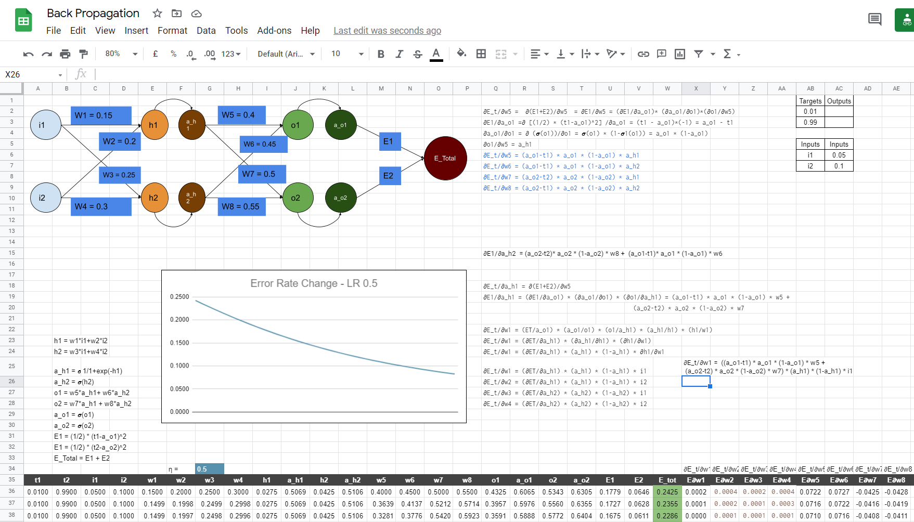
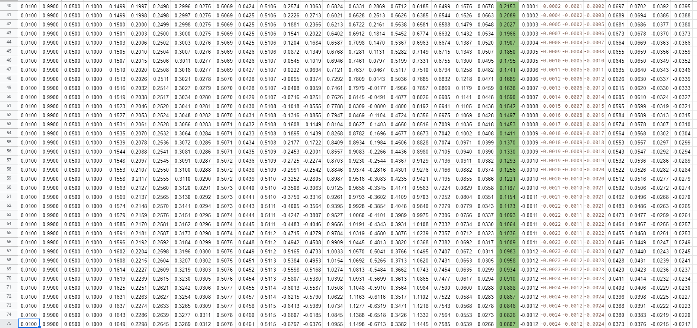
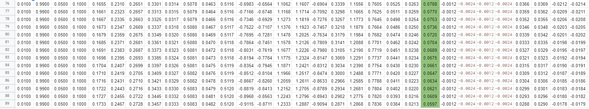
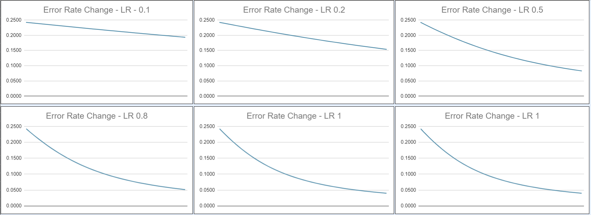
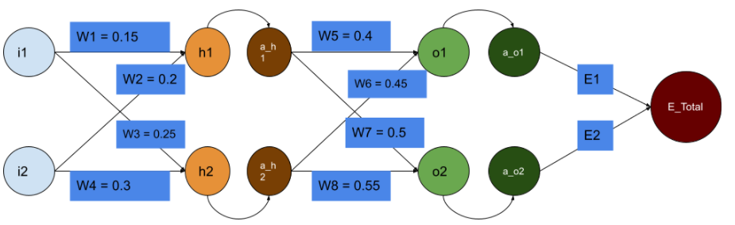

## 
 Assignment 2 

### **Group Members**
Santosh Boina - santoshb183@gmail.com              
Sai Ashok Kumar Reddy - saiashokumareddy@gmail.com              
Jayasankar Raju S - muralis2raj@gmail.com                   

### **Link for the Excel :**
https://docs.google.com/spreadsheets/d/1SyhHUDF9lOPWm2YIUnVUBM43SdyGZEGHzO0xp7zI_NU/edit#gid=0    
 
### Use exactly the same values for all variables as used in the class

### Show what happens to the error graph when you change the learning rate from [0.1, 0.2, 0.5, 0.8, 1.0, 2.0] 

</>

### **Steps during Back Propagation**

Input to the Model -    

| Variable | Input 
|----------|-------:
| i1       | 0.05   
| i2       | 0.1  

Target of the model - 
| Target | Output 
|--------|-------:
| 0.01   |    
| 0.99   |  

Network

Blue boxes in the network are the initialized weights

</>

#### ***Step 1**: Weight Initialization*
Initialize the weights of the neural network. For the sake of convenience we exclude bias from  our calculcation

| Weight | Value 
|--------|-------:
| w1     | 0.15  
| w2     | 0.20
| w3     | 0.25
| w4     | 0.30
| w5     | 0.40
| w6     | 0.45
| w7     | 0.50
| w8     | 0.55
 
#### ***Step 2**: Feed Forward*
We calculate the output of each neuron over the network using the below equations and initialized weights
Equations of each neuron

    h1 = w1*i1+w2*i2		
    h2 = w3*i1+w4*i2		
    a_h1 = 𝝈(h1) = 1/1+exp(-h1)	
    a_h2 = 𝝈(h2) = 1/1+exp(-h2)		
    o1 = w5*a_h1+ w6*a_h2		
    o2 = w7*a_h1 + w8*a_h2		
    a_o1 = 𝝈(o1) = 1/1+exp(-o1)		
    a_o2 = 𝝈(o2) = 1/1+exp(-o2)		
    E1 = (1/2) * (t1-a_o1)^2 		
    E1 = (1/2) * (t2-a_o2)^2 		
    E_Total = E1 + E2		

#### ***Step 3**: Back Propagation*
Objective of this step is to incrementally adjust the weights in order for the network to produce values as close as possible to the expected values from the training data.
Update any weights in the backpropagation using the below equation     

</>

Chain Rule in calculus:    

</>

In order to update the weights from w1 to w8 we need to identify values of the  𝜕E_t/𝜕wi where i = 1,2,3...8

To find value of 

E2 when calculated with respect to w5 is zero, as there is no contribution of w5 in E2. Based on above chain rule in calculus "𝜕E_t/𝜕w5" can be written as combination of (𝜕E1/𝜕a_o1)* (𝜕a_o1/𝜕o1)*(𝜕o1/𝜕w5)

    𝜕E_t/𝜕w5 =  𝜕(E1+E2)/𝜕w5  = 𝜕E1/𝜕w5 = (𝜕E1/𝜕a_o1)* (𝜕a_o1/𝜕o1)*(𝜕o1/𝜕w5)

    𝜕E1/𝜕a_o1 =𝜕 [(1/2) * (t1-a_o1)^2] /𝜕a_o1 = (t1 - a_o1)*(-1) = a_o1 - t1												
    𝜕a_o1/𝜕o1 = 𝜕 (𝝈(o1))/𝜕o1 = 𝝈(o1) * (1-𝝈1(o1)) = a_o1 * (1-a_o1)												
    𝜕o1/𝜕w5 = a_h1	
    											
    𝜕E_t/𝜕w5 = (a_o1-t1) * a_o1 * (1-a_o1) * a_h1							

Replicating the same logic of 𝜕E_t/𝜕w5 to 𝜕E_t/𝜕w6, 𝜕E_t/𝜕w7, 𝜕E_t/𝜕w8

    𝜕E_t/𝜕w6 = (a_o1-t1) * a_o1 * (1-a_o1) * a_h2												
    𝜕E_t/𝜕w7 = (a_o2-t2) * a_o2 * (1-a_o2) * a_h1												
    𝜕E_t/𝜕w8 = (a_o2-t1) * a_o2 * (1-a_o2) * a_h2																

Calculation of 𝜕E_t/𝜕w1
                                         
    𝜕E_t/𝜕a_h1 = 𝜕(E1+E2)/𝜕w5												
    𝜕E1/𝜕a_h1 = (𝜕E1/𝜕a_o1) * (𝜕a_o1/𝜕o1) * (𝜕o1/𝜕a_h1) = (a_o1-t1) * a_o1 * (1-a_o1) * w5 + (a_o2-t2) * a_o2 * (1-a_o2) * w7	

    𝜕E1/𝜕a_h2  = (a_o2-t2)* a_o2 * (1-a_o2) * w8 +  (a_o1-t1)* a_o1 * (1-a_o1) * w6							
                                                    
    𝜕E_t/𝜕w1 = (ET/a_o1) * (a_o1/o1) * (o1/a_h1) * (a_h1/h1) * (h1/w1)												
    𝜕E_t/𝜕w1 = (𝜕ET/𝜕a_h1) * (𝜕a_h1/𝜕h1) * (𝜕h1/𝜕w1)												
    𝜕E_t/𝜕w1 = (𝜕ET/𝜕a_h1) * (a_h1) * (1-a_h1) * 𝜕h1/𝜕w1												
    𝜕E_t/𝜕w1 = (𝜕ET/𝜕a_h1) * (a_h1) * (1-a_h1) * i1												
    𝜕E_t/𝜕w2 = (𝜕ET/𝜕a_h1) * (a_h1) * (1-a_h1) * i2												
    𝜕E_t/𝜕w3 = (𝜕ET/𝜕a_h2) * (a_h2) * (1-a_h2) * i1												
    𝜕E_t/𝜕w4 = (𝜕ET/𝜕a_h2) * (a_h2) * (1-a_h2) * i2												
                                                    
    𝜕E_t/𝜕w1 =  ((a_o1-t1) * a_o1 * (1-a_o1) * w5 + (a_o2-t2) * a_o2 * (1-a_o2) * w7) * (a_h1) * (1-a_h1) * i1												
												
