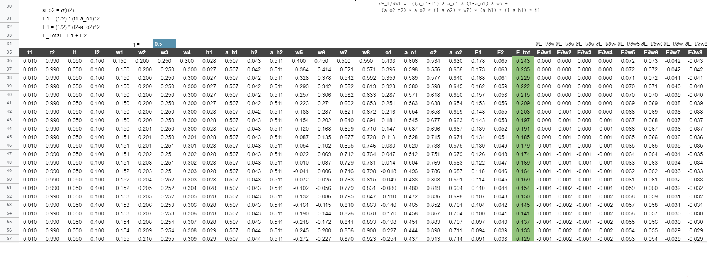

## 
Assignment 2

### Group Members 
Santosh Boina - santoshb183@gmail.com              
Sai Ashok Kumar Reddy - saiashokumareddy@gmail.com              
Jayasankar Raju S - muralis2raj@gmail.com                   

### Link for the Excel : 
https://docs.google.com/spreadsheets/d/1SyhHUDF9lOPWm2YIUnVUBM43SdyGZEGHzO0xp7zI_NU/edit#gid=0    
 
### Use exactly the same values for all variables as used in the class

### Show what happens to the error graph when you change the learning rate from [0.1, 0.2, 0.5, 0.8, 1.0, 2.0] 

### Steps during Back Propagation
