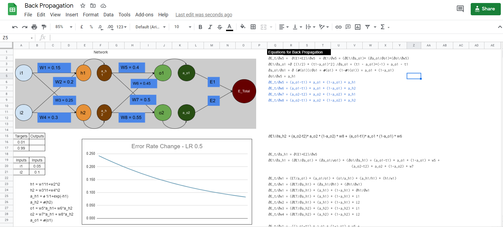

## 
 Assignment 2 

### **Group Members**
Santosh Boina - santoshb183@gmail.com              
Sai Ashok Kumar Reddy - saiashokumareddy@gmail.com              
Jayasankar Raju S - muralis2raj@gmail.com                   

### **Link for the Excel :**
https://docs.google.com/spreadsheets/d/1SyhHUDF9lOPWm2YIUnVUBM43SdyGZEGHzO0xp7zI_NU/edit#gid=0    
 
### Use exactly the same values for all variables as used in the class

### Show what happens to the error graph when you change the learning rate from [0.1, 0.2, 0.5, 0.8, 1.0, 2.0] 

</>

### **Steps during Back Propagation**

Input to the Model -    

| Variable | Input 
|----------|-------:
| i1       | 0.05   
| i2       | 0.1  

Target of the model - 
| Target | Output 
|--------|-------:
| 0.01   |    
| 0.99   |  

Network

</>

