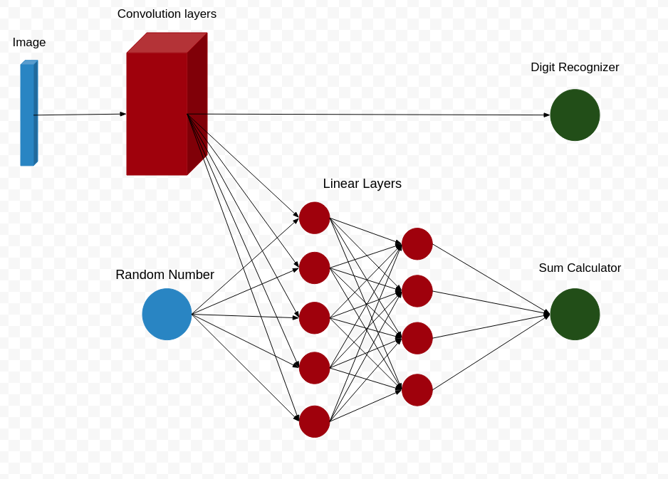

# Session 3  - Assignment

Results
---
Digit Recognizer     
---
Train Accuracy : 98.84%     
Test Accuracy  : 99.07%  

---
Sum Calculator Model    
---
Train Accuracy : 94.47%     
Test Accuracy  : 97.26%     
 
 Team
 ----
Santosh Boina - santoshb183@gmail.com     
Sai Ashok Kumar Reddy - saiashokumareddy@gmail.com     
Jayasankar Raju S - muralis2raj@gmail.com     

---

## Custom Data loader
---

Creation of random integer and new target variable. 
1. Loaded the downloaded data from the colab environment using torch.load method
2. In the "__getitem__" method,   
          1) Created random integer   
          2) Made a tuple with the expected target variables and input variables  

     

        class CustomLoader_MNIST(DataLoader):
        def __init__(self,pt_path):
            self.path = pt_path
            self.data = torch.load(self.path)
            

        def __getitem__(self, idx):
        if torch.is_tensor(idx):
            idx = idx.tolist()

        image, label = self.data[0][idx], self.data[1][idx] 

        randInt = torch.randint(0,9,(1,))
        x1, x2, y1, y2 = image.reshape(1,28,28), randInt, label, label + randInt[0]

        return x1, x2, y1, y2

        def __len__(self):
        return len(self.data[0])

In the __getitem__ method, along with x1 and y1, x2(newly generated Random Number) and y2(sum of digit and random number) are computed and passed on like 4 item tuple. 

## Model Architecture
---

Model is designed in syn with the above structure
    1) Blue's are inputs    
    2) Red's actual network    
    3) Green's are output    

1) Output1, which is output of convolution layers used for Digit Recognition and the same is fedback into two linears layers with ReLu activation layer between them along with random number.
2) The second network generates output2
3) Loss is calculated using Negative Log likelihood. Cross Entropy and Negative Log likelihood are used for multi classification. Tried both loss functions, chosen Negative log likelihood as its performing better.

## Result Evaluation
---
Test data of Mnist coupled with random generated digit and sum(digit+random digit) are used for evaluating the results. Accuracy change over the epochs are showed in the below plot.

No of Epochs could have been reduced using the LRScheduler and all. 